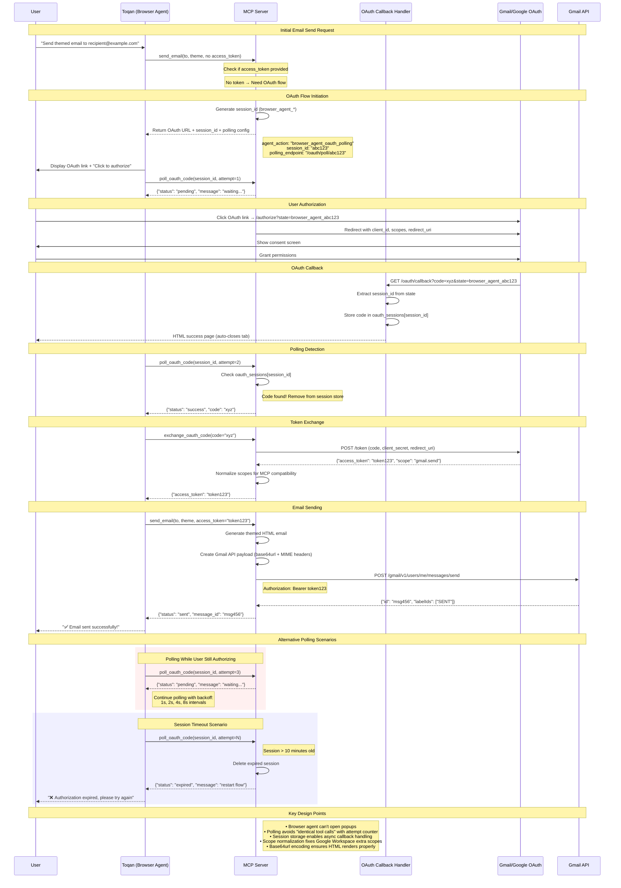

# Send Email OAuth Flow Sequence Diagram



## Key Components

### 1. **MCP Server Endpoints**
- `/authorize` - Redirects to Google OAuth
- `/oauth/callback` - Handles Google's redirect with auth code  
- `/token` - Exchanges auth code for access token
- `/oauth/poll/{session_id}` - Browser agent polling endpoint

### 2. **Browser Agent Flow**
- Cannot open popup windows
- Uses polling mechanism with exponential backoff
- Session-based code retrieval prevents race conditions

### 3. **OAuth Session Storage**
```python
oauth_sessions = {
    "abc123": {
        "code": "auth_code_xyz", 
        "timestamp": datetime.now(),
        "state": "browser_agent_abc123"
    }
}
```

### 4. **Polling Strategy**
- Exponential backoff: 1s, 2s, 4s, 8s intervals
- Maximum 60 second timeout
- Attempt counter prevents "identical tool calls" error
- Session cleanup after 10 minutes

### 5. **Gmail Integration**
- Scope normalization for Google Workspace compatibility
- Base64url encoding with MIME headers
- HTML email rendering via `Content-Type: text/html`
